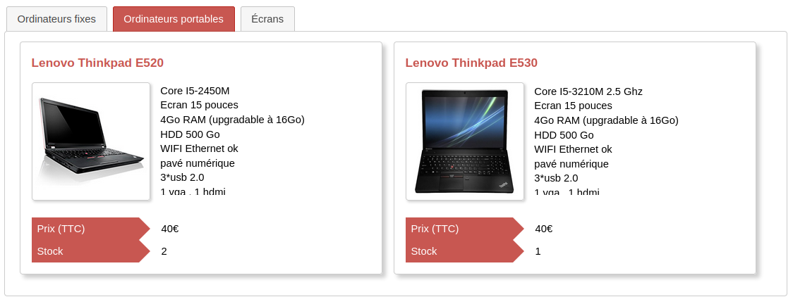

# PublicStock plugin for [Dolibarr ERP CRM](https://www.dolibarr.org)

*Pour la version française de ce README, voir plus bas.*

## English

### Features

This plugin allows you to set up a store front in which to display publicly the products in your Dolibarr. It is **not** an e-commerce plugin. It is mainly intended for organizations with a physical point of sale, simply wishing to make the content of their stock public.

It creates a public page (no Dolibarr authentication required) that you can use as is or most likely include in your website.

In detail, the plugin allows you to:
- Classify products according to their category (one tab per category)
- Choose the data you want to display on each product (in particular if prices are displayed VAT or taxes excluded)
- Choose whether or not to display products out of stock
- Use one of the visual themes delivered with the plugin
- Customize this theme or create yours (you need to know the [CSS](https://developer.mozilla.org/en/docs/Web/CSS) language)

The module administration page allows you to set up all these options and also provides a link to the public page created.

This plugin is available in the following languages :
- Dutch
- English
- French

### Installation

- Download the .zip archive
- In Dolibarr, go to Home > Setup > Modules/Applications > Deploy/install external app/module
- Upload the .zip archive and submit

### Setup

- In Dolibarr, go to Home > Setup > Modules/Applications
- Find "PUBLIC STOCK" and click the gear icon

### Contributing

The project is hosted on [Codeberg](https://codeberg.org/halibut/dolibarr_public_stock).

#### Translations

To translate it into another language, you can add a subfolder in "langs" with the [language code](https://en.wikipedia.org/wiki/List_of_ISO_639_language_codes) and the [country code](https://en.wikipedia.org/wiki/ISO_3166-1_alpha-2#Officially_assigned_code_elements). For example `es_AR` for Spanish from Argentina. Then copy the "publicstock.lang" file from the "fr_FR" or "en_US" folder and replace the translations with your own.

If you wish, you can then submit this translation in a [pull request](https://docs.codeberg.org/collaborating/pull-requests-and-git-flow/]) to benefit the community.

#### Themes

To create a new theme, add a {themeName}.css file in the **css** directory with your styles. To make it available in the plugin configuration screen, you must then modify the **admin/setup.php** file and add the display and file names of your theme in the definition of the `PUBLICSTOCK_THEME` field.

Again, we invite you if you wish to submit a pull request to benefit the community.

### Features / Bug fixes

This plugin was mainly designed to meet the needs of the French association [Artifaille](https://artifaille.fr/). Its features may not be sufficient for other organizations with other needs. Feel free to create [an issue](https://docs.codeberg.org/getting-started/issue-tracking-basics/) to report a bug or suggest a feature.

## Licenses

### Source code

The source code is under GPL v3. See the **COPYING** file for more information.

### Documentation

Documentation is licensed under [GFDL v1.3](https://www.gnu.org/licenses/fdl-1.3.en.html)

## Français

### Fonctionnalités

Ce module permet de mettre en place une vitrine dans laquelle rendre visibles publiquement les produits figurant dans votre Dolibarr. Ce n'est **pas** un module d'e-commerce. Il est principalement destiné à des organisations avec un point de vente physique, souhaitant simplement rendre le contenu de leur stock public.

Il crée une page publique (pas d'authentification à Dolibarr nécessaire) que vous pouvez utiliser telle quelle ou plus probablement inclure dans votre site web.

Dans le détail, le module permet de :
- Classer les produits en fonction de leur catégorie (un onglet par catégorie)
- Choisir les données que vous souhaitez afficher sur chaque produit (en particulier si les prix sont affichés TTC ou hors taxe)
- Choisir d'afficher ou non les produits en rupture de stock
- Utiliser un des thèmes visuels livrés avec le module
- Personnaliser ce thème ou créer le vôtre (nécessite de connaître le langage [CSS](https://developer.mozilla.org/fr/docs/Web/CSS))

La page d'administration du module permet de paramétrer toutes ces options et vous fournit également l'adresse de la page publique crée.

Ce module est disponible dans les langues suivantes :
- Anglais
- Français
- Néerlandais
 
### Installation

- Télécharger l'archive .zip
- Dans Dolibarr, aller dans Accueil > Configuration > Modules/Applications > Deployer/Installer un module externe
- Déposer l'archive .zip et valider

### Configuration

- Dans Dolibarr, aller dans Accueil > Configuration > Modules/Applications
- Trouver "PUBLIC STOCK" et cliquer sur l'icône en forme d'engrenage

### Contribuer

Le projet est hébergé sur [Codeberg](https://codeberg.org/halibut/dolibarr_public_stock).

#### Traductions

Pour le traduire dans une autre langue, vous pouvez ajouter un sous-dossier dans "langs" avec le [code de la langue](https://fr.wikipedia.org/wiki/Liste_des_codes_ISO_639-1) et le [code du pays](https://en.wikipedia.org/wiki/ISO_3166-1_alpha-2#Officially_assigned_code_elements). Par exemple `es_AR` pour l'espagnol d'Argentine. Copiez-y ensuite le fichier "publicstock.lang" du dossier "fr_FR" ou "en_US" et remplacez les traductions par les vôtres.

Si vous le souhaitez, vous pouvez ensuite soumettre cette traduction dans une [pull request](https://docs.codeberg.org/collaborating/pull-requests-and-git-flow/]) pour en faire profiter la communauté.

#### Thèmes

Pour créer un nouveau thème, ajouter un fichier {nomTheme}.css dans le répertoire **css** avec vos styles. Pour le rendre disponible dans l'écran de configuration du module, il faut ensuite modifier le fichier **admin/setup.php** et ajouter le nom d'affichage et le nom du fichier CSS de votre thème dans la définition du champ `PUBLICSTOCK_THEME`.

Là aussi, nous vous invitons si vous le souhaitez à soumettre une pull request pour en faire profiter la communauté.

#### Fonctionnalités / Corrections de bugs

Ce module a été principalement conçu pour répondre aux besoins de l'association française [Artifaille](https://artifaille.fr/). Ses fonctionnalités ne seront pas forcément suffisantes pour d'autres organisations avec d'autres besoins. N'hésitez pas à créer [un ticket](https://docs.codeberg.org/getting-started/issue-tracking-basics/) pour signaler un bug ou proposer une fonctionnalité.

### Licences

#### Code source

Le code source est sous licence GPL v3. Voir le fichier **COPYING** (en anglais) pour plus d'information.

#### Documentation

La documentation est sous licence [GFDL v1.3](https://www.gnu.org/licenses/fdl-1.3.en.html)
